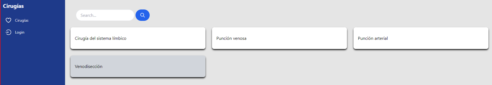

<center>  </center>

# Repositorio de procedimientos quirúrgicos 💉👨‍⚕️👩‍⚕️

Este repositorio contiene el código para el proyecto de grados presentado con fin de obtener el título de Tecnólogo de software en la [Institución Universitaria Pascual Bravo](https://pascualbravo.edu.co/) (IUPB).

## Objetivo

El objetivo de este proyecto consiste en diseñar y crear un repositorio web para la ayuda en la planeación de técnicas quirúrgicas a emplear en los diferentes pacientes según su criterio médico. 

## Instalación (Windows y Ubuntu)

La operación del repositorio depende de la instalación de los siguientes paquetes. Sigue las instrucciones de instalación antes de ejecutar el repositorio:  

 - [Node.Js](https://nodejs.org/es) 
 - [Tailwind](https://tailwindcss.com/)
 - [MongoDB](https://www.mongodb.com/)
 - [Cloudinary](https://cloudinary.com/)

### Variables de Entorno

Para la ejecución correcta del repositorio es necesario configurar las siguientes variables de entorno para las herramientas **MongoDB** y **Cloudinary**. \

- Para MongoDB hace falta incluír:
```
MONGODB_URI = URI de base de datos
PORT = 4000
```

- Para Cloudinary hace falta crear una cuenta en su respectivo [sitio web](https://cloudinary.com/) y desde el menú Dashboard consultar las Product Environment Credentials. Una vez obtenidas las credenciales hace falta reemplazarlas en las siguientes variables

```
CLOUD_NAME = <Cloud Name>
API_KEY = <API Key> 
API_SECRET = <API Secret>
```

### Iniciando el Backend ⚙️🛠️

Para iniciar el backend del repositorio sólo deberás ejecutar el siguiente comando en la raíz del proyecto:

```
cd ~/surgeries_repository
npm run dev
```
 
Este comando ejecutará el script definido en el archivo ```package.json``` que generalmente se encarga de iniciar el servidor backend.


### Ejecutando el Cliente 💻📱

Para iniciar el cliente deberás ingresar en el directorio ```client``` y ejecutar el siguiente comando en la raíz del proyecto:

```
cd ~/surgeries_repository/client
npm start
```

Esto iniciará el cliente y debería abrir una ventana en el navegador con la aplicación web.

De esta manera, estarás ejecutando el backend y el cliente del proyecto en dos consolas diferentes simultáneamente.


⚠️📢 **NOTA**: Revisa que tengas instalado [Node.Js] con el comando ```node --version``` y asegúrate de que los comandos ```npm run dev``` y ```npm start``` estén configurados correctamente en los archivos ```package.json``` de cada parte (backend y cliente) del proyecto.

## Interfaz y navegación

### Panel de control

Este es el Home de la Aplicación que cuenta con una sidebar, una barra de búsqueda y el listado de cirugías.

<center>  </center>

### Consulta de procedimientos 

Al hacer clic en el nombre de una cirugía se desplegará la consulta con la información de la cirugía.

<center>  </center>

\
Esta consulta arrojará la información necesarioa para que el especialista determine si la cirugía consultada corresponde con el procedimiento adecuado que debe practicar, y las recomendaciones posteriores a este procedimiento.


## Trabajos futuros y posibles mejoras 📚🚀

Dado que este repositorio es preliminar, se pretende expandir la base de datos con más entradas y diferentes tipos de procedimientos basados en fuentes científicas establecidas.


## Agradecimientos

Este repositorio ha sido creado y construido con el apoyo de la [Institución Universitaria Pascual Bravo](https://pascualbravo.edu.co/) (IUPB).


<!--
## Licencia


Este tema lo podemos tratar. Yo sugeriría CC-BY-NC 4.0, pero podemos mirarlo luego.
-->


## Contacto:

**🗣️** [Santiago Ramírez Valencia](https://github.com/SnNig1) \
**🗣️** [Rubén Fonnegra](https://github.com/rubenfonnegra) \
**🗣️** Jaime Soto


**✉️ Email Institucional:** s.ramirez1@pascualbravo.edu.co \
**✉️ Email Personal:** santiago.ram.val.22@gmail.com 


